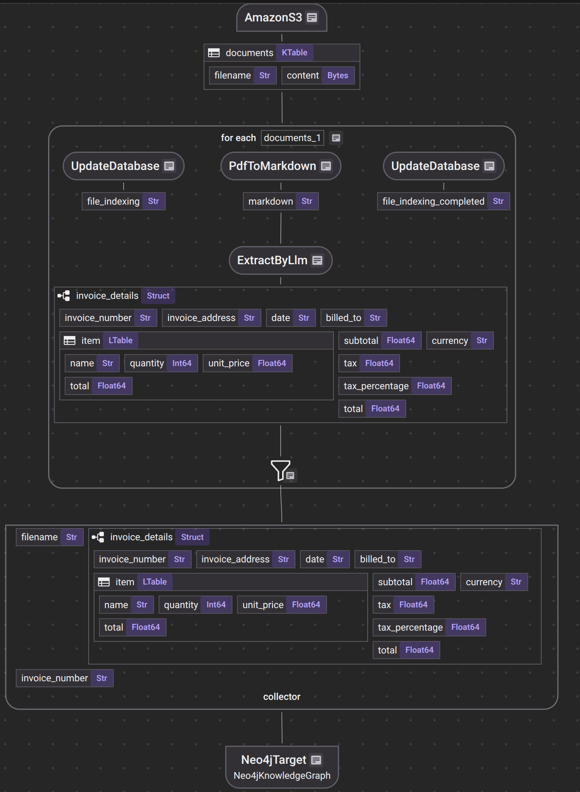

# Invoice Chatbot

A **production-ready live invoice indexing system**. Users upload invoices via a modern web UI, and the system automatically extracts, structures, and indexes them into a **Neo4j knowledge graph** for semantic search and conversational Q&A.

This repository demonstrates a **complete, event-driven document ingestion pipeline**: from S3 uploads, through SQS notifications, PDF extraction (Docling), LLM-based semantic enrichment, and idempotent persistence in Neo4j.

Live development endpoints (default):

* **CocoIndex Insight:** [https://cocoindex.io/cocoinsight/](https://cocoindex.io/cocoinsight/)
* **Neo4j Browser (local):** [http://localhost:7474/browser/](http://localhost:7474/browser/)
* **Frontend UI:** [http://localhost:3000](http://localhost:3000)

---

## Table of Contents

* [About](#about)
* [Architecture](#architecture)
  * [Indexing Diagram](#indexing-diagram)
* [Features](#features)
* [Quick Start](#quick-start)
* [Local Development](#local-development)

---

## About

Invoice Chatbot is a **production-oriented prototype** for live invoice indexing and document-aware conversational search. It demonstrates a full, event-driven ingestion pipeline where uploaded invoices are:

1. Stored in S3
2. Extracted and enriched with LLMs
3. Persisted into a Neo4j knowledge graph for fast retrieval and conversational queries

**Key concepts demonstrated:**

* **Live ingestion:** Frontend uploads → S3 → SQS notification → backend triggers indexing.
* **PDF extraction:** Docling converts PDF invoices into Markdown/structured text.
* **Semantic extraction:** LLM maps extracted text into structured types (Invoice, Vendor, LineItem, Dates, Totals), validated and normalized before persistence.
* **Graph persistence:** Idempotent `MERGE`-style writes in Neo4j prevent duplication and allow safe updates.
* **Developer tooling:** Local Docker Compose setup and scripts for fast iteration.

---

## Architecture

The system is organized into clear components:

### Frontend (`frontend/`)

* **Tech:** Next.js + React (TypeScript)
* **Responsibilities:**

  * User interface for uploading invoices
  * Presigned S3 upload URL requests
  * Chat interface for invoice queries
  * Invoice list and upload UX
* **Flow:** User selects PDF → requests presigned S3 URL → file uploaded to S3

### Backend (`backend/` and `backend/src/`)

* **Tech:** Python
* **Responsibilities:**

  * API endpoints and indexing orchestration
  * SQS listener and CocoIndex integration
  * PDF extraction via Docling
  * LLM calls for semantic extraction
  * Neo4j persistence and cache management
* **Key files:**

  * `indexing.py`, `agent.py`, `app.py`, `cache_manager.py`, `config.py`

### Indexing Pipeline

* **Trigger:** S3 event → SQS notification → CocoIndex listener
* **Steps:**

  1. PDF → Markdown extraction (Docling)
  2. LLM → structured JSON objects (Invoice, Vendor, LineItem, amounts, dates)
  3. Validation → persistence into Neo4j

### Persistence & Storage

* **Neo4j:** Knowledge graph of invoices, vendors, and relationships
* **S3:** Object storage for uploaded PDFs
* **SQS:** Event queue decoupling uploads from indexing; supports retries and dead-letter queues
* **Postgres / local data:** Optional metadata, test fixtures, and secondary storage (`backend/data/`)

### Orchestration & Infra

* **Docker Compose (`docker-compose.yaml`):** Runs the full stack locally, including services, Neo4j, Postgres, and more

### Observability & Reliability

* Health checks for backend listener
* Retry strategies and SQS DLQs
* Idempotent writes using timestamps and checksums

---

### Indexing Diagram


*Visual diagram of the document indexing pipeline (backend workflow). See `diagram/indexing_flow.png` in the repository.*

---

## Features

* **Live invoice ingestion:** Upload PDFs → automatic indexing
* **PDF extraction & enrichment:** Docling → structured JSON via LLM
* **Graph persistence:** Neo4j MERGE writes prevent duplication
* **Semantic search & Q&A:** Query invoice data via conversational interface
* **Event-driven architecture:** SQS queues for reliable, decoupled processing
* **Local development tooling:** Docker Compose, Python, and Node.js scripts
* **Testing:** Comprehensive backend unit tests

---

## Quick Start

**Prerequisites:**

* Docker & Docker Compose
* Node.js and Python installed

**Steps:**

1. Copy `.env.example` to `.env`
2. Set up **AWS S3 and SQS** following [CocoIndex AWS docs](https://cocoindex.io/docs/sources/amazons3)
3. Start the stack:

```bash
docker-compose up --build
```

4. Open the frontend: [http://localhost:3000](http://localhost:3000)

**Stop the stack:**

```bash
docker-compose down
```
---
